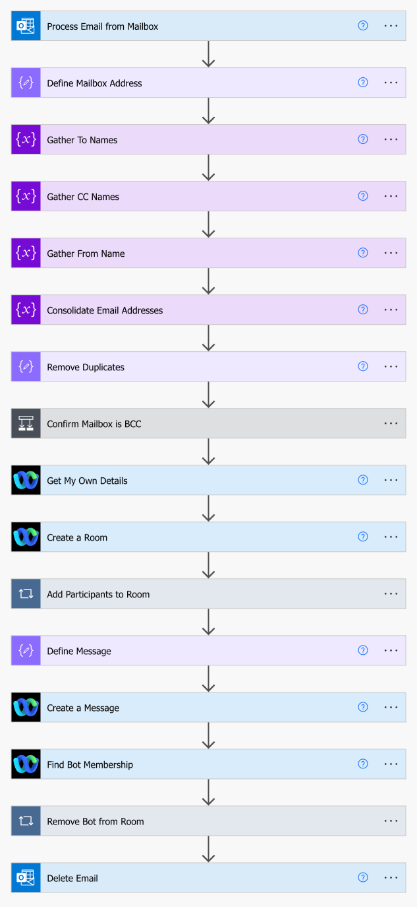

# Email2Webex

Email2Webex is a Power Automate Flow allowing moving an Email thread to a new Webex Space if the assigned mailbox is included in the BCC List.

This flow can use either a local or shared mailbox for processing requests.

## Prerequisites

This flow requires the following:
- Installation of a custom connector [swagger-webex](https://github.com/jeremywillans/swagger-webex)
- A Webex Bot - create at [developer.webex.com](https://developer.webex.com/my-apps/new/bot) 

## Deployment (Simple)

1. Download the Zip file located in the solution folder.
2. Open and authenticate into [Power Automate](https://make.powerautomate.com)
3. Ensure you have installed the custom connector [swagger-webex](https://github.com/jeremywillans/swagger-webex)
4. Create a new connection to the custom connector
 - Navigate to Data, Custom connectors, select the `+` next to the Webex Connector
 - Provide the API Key using the following format `Bearer <BOT TOKEN>` (the Bot Token is generated from the Bot creation in the prerequisite step)
 - (Optional) Edit the new Webex connection (selecting the three dots), updating the Display Name for easier connection differentiation (you will need to re-enter the API Key)
5. Navigate to My flows.
6. From the `Import` dropdown, select `Import Package` and import the Zip file from Step 1.
7. Update the related resources, and complete importing the package.
 - Connector: Select the custom connector installed from Step 3.
 - Connections: Select existing, or create new connections for both Webex (refer Step 4.) and Office 365
8. Once complete, open the flow and review the following steps:
 - **Process Email from Mailbox** - update the `Original Mailbox Address` with either a local or shared mailbox identity
 - **Define Mailbox Address** - update this to reflect the mailbox address
 - **Delete Email** - update the `Original Mailbox Address` with shared mailbox identity, if required
9. Save and enable the flow.
10. Test by sending an email as BCC to the mailbox!

## Deployment (Manual - Advanced)

If you prefer not to import the Zip file, this flow can be created manually, the steps are outlined below

1. (Trigger) Process Email from Mailbox [When a new email arrives in a shared mailbox (V2)]
  - **Original Mailbox Address** - update with local or shared mailbox identity
2. Define Mailbox Address [Data Operation - Compose]
  - **Inputs** - reflect the mailbox address
3. Gather To Names [Variables - Initialize variable]
  - **Name** - `mailTo`
  - **Type** - String
  - **Value** - (*Process Email from Mailbox*) Mailbox To
4. Gather CC Names [Variables - Initialize variable]
  - **Name** - `mailCc`
  - **Type** - String
  - **Value** - (*Process Email from Mailbox*) Mailbox Cc
5. Gather From Name [Variables - Initialize variable]
  - **Name** - `mailFrom`
  - **Type** - String
  - **Value** - (*Process Email from Mailbox*) Mailbox From
6. Consolidate Email Addresses [Variables - Initialize variable]
  - **Name** - `mailArray`
  - **Type** - Array
  - **Value** - (*Expression*) `split(concat(if(empty(variables('mailTo')),'',concat(variables('mailTo'),';')),if(empty(variables('mailCc')),'',concat(variables('mailCc'),';')),variables('mailFrom')),';')`
7. Remove Duplicates [Data Operation - Compose]
  - **Inputs** - `union(variables('mailArray'),variables('mailArray'))`
8. Confirm Mailbox is BCC [Control - Condition]
  - (*Remove Duplicates*) Outputs *includes* (*Define Mailbox Address*) Outputs
  - If yes -> Control - Terminate
  - If no -> < blank >
9. Webex - Get My Own Details
10. Webex - Create a Room
  - **title** - (*Process Email from Mailbox*) Mailbox Subject
11. Add Participants to Room [Control - Apply to each]
  - **Output** - (*Remove Duplicates*) Outputs
  - Action: Webex - Create a Membership
  - **roomId** - (*Create a Room*) roomId
  - personEmail - (*Add Participants to Room*) Current Item
12. Define Message [Data Operation - Compose]
  - **Inputs** - (*Expression*) `concat('This space was created by ', variables('mailFrom'), ' to continue the discussion from the email thread using Webex!')`
13. Webex - Create a Message
  - **roomId** - (*Create a Room*) roomId
  - **markdown** - (*Define a Message*) Outputs
14. Webex - Find Bot Membership
  - **roomId** - (*Create a Room*) roomId
  - **personId** - (*Get My Own Details*) personId
15. Remove Bot from Room [Control - Apply to each]
  - **Output** - (*Find Bot Membership*) inputs
  - Action: Webex - Delete a Membership
  - **membershipId** - (*Find Bot Membership*) membershipId
16. Delete Email [Delete email (V2)]
  - **Message Id** - (*Process Email from Mailbox*) Message Id
  - **Original Mailbox Address** - update with local or shared mailbox identity

## Support

In case you've found a bug, please [open an issue on GitHub](../../../issues).

## Disclaimer

This software is NOT guaranteed to be bug free and production quality.
