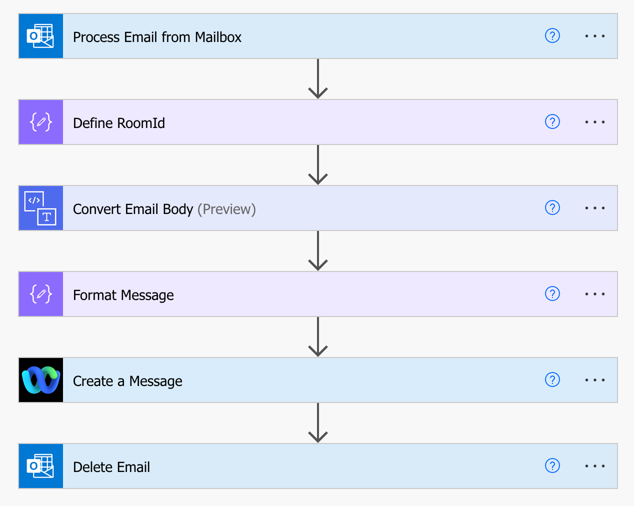

# Message2Webex

Message2Webex is a Power Automate Flow that converts received Email messages and posts them into a Webex Space.

This flow can use either a local or shared mailbox for processing requests.

## Prerequisites

This flow requires the following:
- Installation of a custom connector [swagger-webex](https://github.com/jeremywillans/swagger-webex)
- A Webex Bot - create at [developer.webex.com](https://developer.webex.com/my-apps/new/bot) 
- An existing Webex Space with the Webex bot as a member.
- The RoomId of the destination Webex space. These example methods can be used to get the Room Id
  - Using the [List Rooms](https://developer.webex.com/docs/api/v1/rooms/list-rooms) Developer API
  - Adding `astronaut@webex.bot` to the space (bot will leave and 1:1 you the Id)
  - 1:1 Message `astronaut@webex.bot`, with an @Mention of the Space Name

## Deployment (Simple)

1. Download the Zip file located in the solution folder.
2. Open and authenticate into [Power Automate](https://make.powerautomate.com)
3. Ensure you have installed the custom connector [swagger-webex](https://github.com/jeremywillans/swagger-webex)
4. Create a new connection to the custom connector (if not already existing)
 - Navigate to Data, Custom connectors, select the `+` next to the Webex Connector
 - Provide the API Key using the following format `Bearer <BOT TOKEN>` (the Bot Token is generated from the Bot creation in the prerequisite step)
 - (Optional) Edit the new Webex connection (selecting the three dots), updating the Display Name for easier connection differentiation (you will need to re-enter the API Key)
5. Navigate to My flows.
6. From the `Import` dropdown, select `Import Package` and import the Zip file from Step 1.
7. Update the related resources, and complete importing the package.
 - Connector: Select the custom connector installed from Step 3.
 - Connections: Select existing, or create new connections for Webex (refer Step 4.), Office 365 and Content Conversion
8. Once complete, open the flow and review the following steps:
 - **Process Email from Mailbox** - update the `Original Mailbox Address` with either a local or shared mailbox identity
 - **Define RoomId** - update this to reflect the RoomID of the destination Webex Space (refer Prerequisites above)
 - **Delete Email** - update the `Original Mailbox Address` with either a local or shared mailbox identity (same as above)
9. Save and enable the flow.
10. Test by sending an email to the mailbox!

## Deployment (Manual - Advanced)

If you prefer not to import the Zip file, this flow can be created manually, the steps are outlined below

1. (Trigger) Process Email from Mailbox [When a new email arrives in a shared mailbox (V2)]
  - **Original Mailbox Address** - update with local or shared mailbox identity
2. Define RoomId [Data Operation - Compose]
  - **Inputs** - reflect the Webex Space RoomId
3. Convert Email Body [Content Conversion - Html to text]
  - **Content** - (*Process Email from Mailbox*) Body
6. Format Message [Data Operation - Compose]
  - **Inputs** - (*Expression*) `concat('From: ', triggerOutputs()?['body/from'], decodeUriComponent('%0A'), '## ', triggerOutputs()?['body/subject'], decodeUriComponent('%0A'), replace(outputs('Convert_Email_Body')?['body'], decodeUriComponent('%0A%0A'), decodeUriComponent('%20%20%0A')))`
13. Webex - Create a Message
  - **roomId** - (*Define RoomId*) Outputs
  - **markdown** - (*Format Message*) Outputs
16. Delete Email [Delete email (V2)]
  - **Message Id** - (*Process Email from Mailbox*) Message Id
  - **Original Mailbox Address** - update with local or shared mailbox identity

## Troubleshooting

If your flow fails with the error `Could not find a room with provided ID.`, this means the Bot is not a member of the provided Webex Space. Please add the bot and test again.

## Support

In case you've found a bug, please [open an issue on GitHub](../../../issues).

## Disclaimer

This software is NOT guaranteed to be bug free and production quality.
