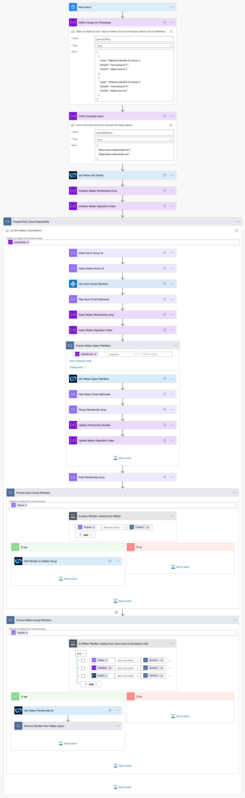

# SyncAzureToWebex

[](https://github.com/jeremywillans/swagger-webex)

SyncAzureToWebex is a Power Automate flow allowing you to synchronize members of selected Azure Groups with a matching Webex Space.

## Prerequisites

This flow requires the following:
- Installation of a custom connector [swagger-webex](https://github.com/jeremywillans/swagger-webex)
- A Webex Bot - create at [developer.webex.com](https://developer.webex.com/my-apps/new/bot)
- The Object Id of each Azure Group you wish to sync. This can be obtained from the Azure AD Portal.
- An existing Webex Space with the Webex bot as a member for each Group
- The RoomId of each destination Webex space. These example methods can be used to get the Room Id
  - Using the [List Rooms](https://developer.webex.com/docs/api/v1/rooms/list-rooms) Developer API
  - Adding `astronaut@webex.bot` to the space (bot will leave and 1:1 you the Id)
  - 1:1 Message `astronaut@webex.bot`, with an @Mention of the Space Name

## Deployment (Simple)

1. Download the Zip file located in the solution folder.
2. Open and authenticate into [Power Automate](https://make.powerautomate.com)
3. Ensure you have installed the custom connector [swagger-webex](https://github.com/jeremywillans/swagger-webex)
4. Create a new connection to the custom connector (if not already existing)
 - Navigate to Data, Custom connectors, select the `+` next to the Webex Connector
 - Provide the API Key using the following format `Bearer <BOT TOKEN>` (the Bot Token is generated from the Bot creation in the prerequisite step)
 - (Optional) Edit the new Webex connection (selecting the three dots), updating the Display Name for easier connection differentiation (you will need to re-enter the API Key)
5. Navigate to My flows.
6. From the `Import` dropdown, select `Import Package` and import the Zip file from Step 1.
7. Update the related resources, and complete importing the package.
 - Connector: Select the custom connector installed from Step 3.
 - Connections: Select existing, or create new connections for Webex (refer Step 4.) and Azure AD
8. Once complete, open the flow and review the following steps:

 - **Recurrence** - update with the time interval requires for sync
 - **Define Groups for Processing** - update this to reflect a list of objects containing details for the matching Azure Group and Webex Space.

   **Note:** Ensure this field is formatted correctly as a JSON Array of Objects, refer the Troubleshooting section for more details.
 - **Define Excluded Users** - update this field with an array of users who are excluded from the removal process.

9. Save and enable the flow - it will start automatically
10. Refresh Run history and verify the flow runs successfully.

## Troubleshooting

Ensure you **do not** enable concurrently for `Process Each Group Sequentially` as this will result in unexpected results!
This is due to the use of Variables in the flow to support Webex pagination (used when group members exceed 1000)

If your flow fails with the error `Could not find a room with provided ID.`, this means the Bot is not a member of the provided Webex Space. Please add the bot and test again.

The below shows the sample content (JSON Array of Objects) used for the `Define Groups for Processing` variable.  The format of this field is important to ensure each Azure to Webex Group is mapped correctly (the included `name` field is just for administrator reference). 

You can use a JSON Formatter ([example](https://jsonformatter.org/)) to validate the content.
```
[
  {
    "name": "Reference Identifier for Group 1",
    "groupId": "azure-group-id-1",
    "roomId": "webex-room-id-1"
  },
  {
    "name": "Reference Identifier for Group 2",
    "groupId": "azure-group-id-2",
    "roomId": "webex-room-id-2"
  }
]
```
For larger requirements, this flow can also be modified to import records from another source, such as the [Microsoft Dataverse](https://docs.microsoft.com/en-us/power-automate/dataverse/list-rows)

## Flow Diagram (Expanded)



## Support

In case you've found a bug, please [open an issue on GitHub](../../../issues).

## Disclaimer

This software is NOT guaranteed to be bug free and production quality.
